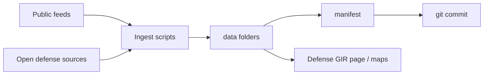
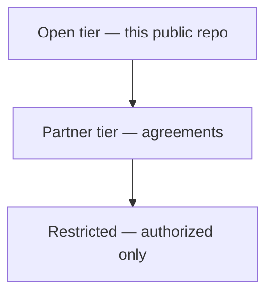
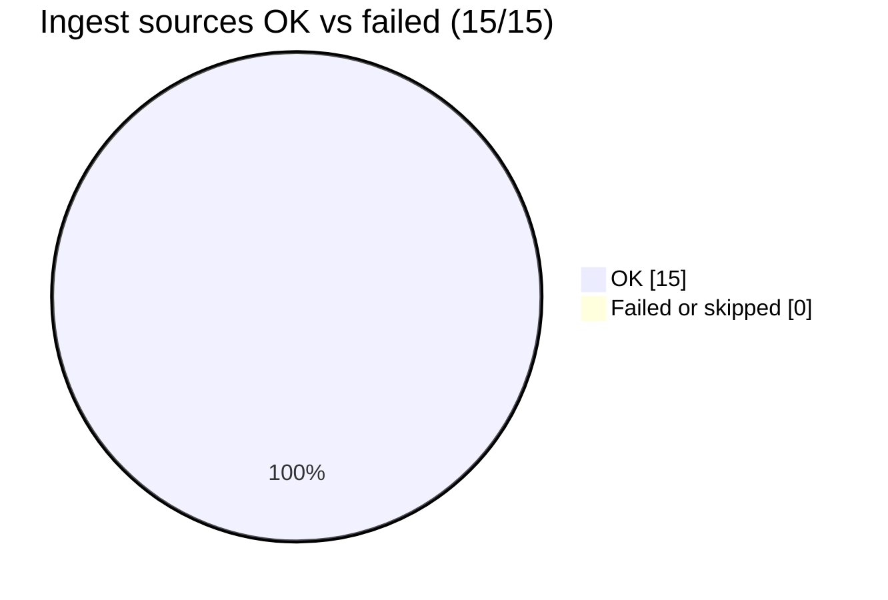
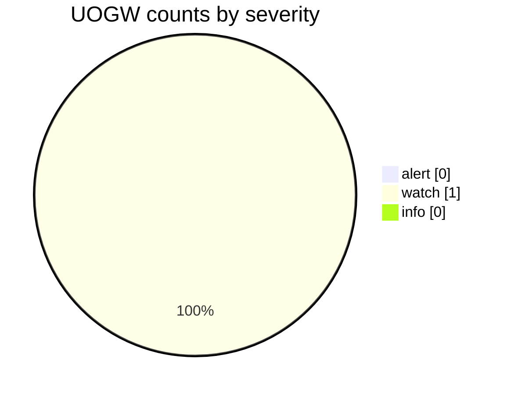
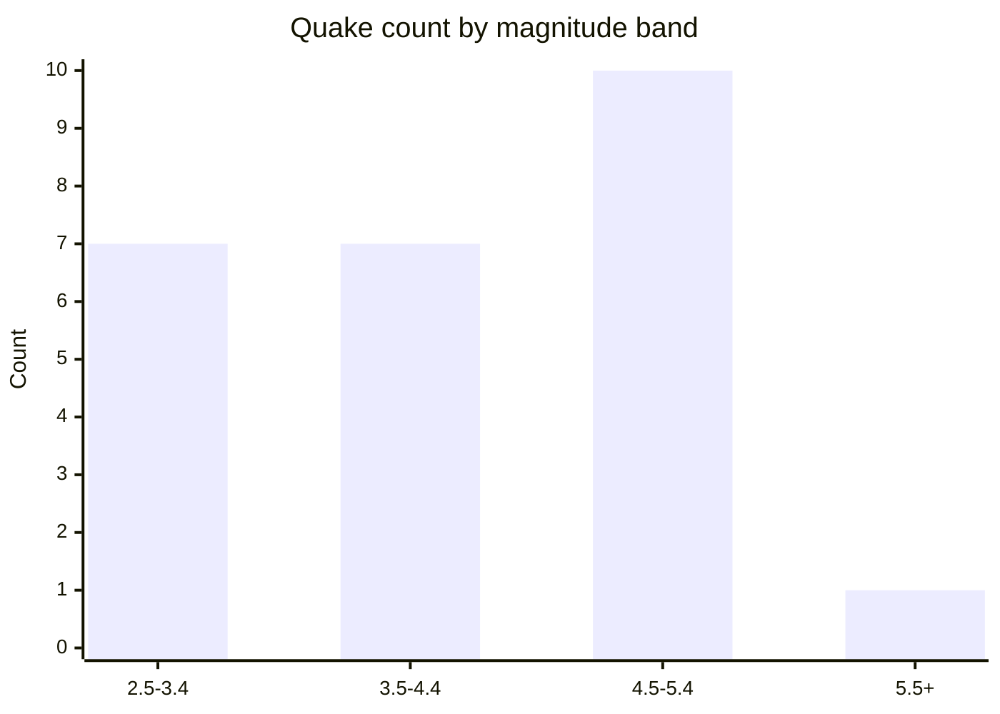
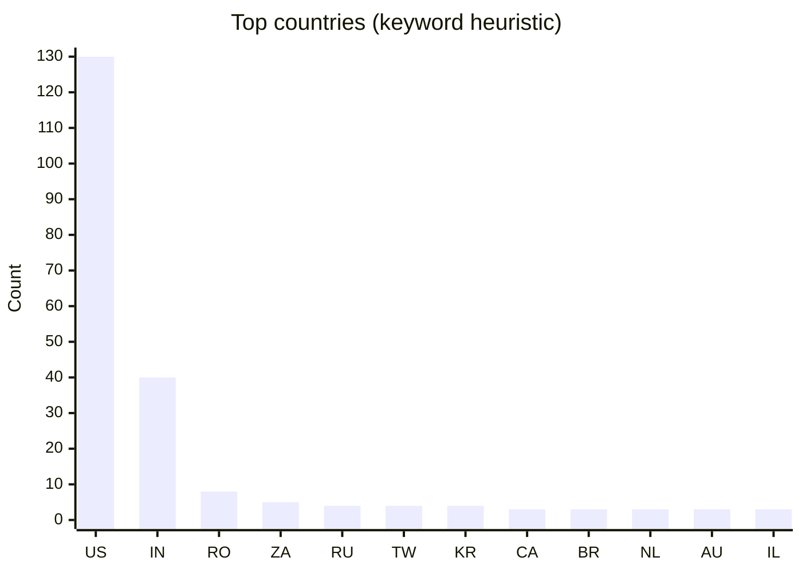

# GIR graphs (git markup)

_Generated 2026-09-01 11:14 UTC from open-tier data. Mermaid only — no image binaries._

Regenerate:

```bash
python3 scripts/generate_gir_charts.py
```

## Data flow



## Access tiers



## Daily ingest status

**Last run:** `2026-09-01T11:14:26.134952+00:00` · **15/15 sources OK**



| Source | Status |
|--------|--------|
| `uogw_anomalies` | OK |
| `eonet_events` | OK |
| `eonet_geojson` | OK |
| `usgs_quakes` | OK |
| `nws_alerts` | OK |
| `sentinel2_stac` | OK |
| `donki_cme` | OK |
| `cisa_kev` | OK |
| `ourairports_military_keywords` | OK |
| `usaspending_defense` | OK |
| `gdelt_lastupdate` | OK |
| `opensky_midwest` | OK |
| `osm_military_landuse` | OK |
| `firms` | OK |
| `partner_stubs` | OK |

## UOGW anomaly severity

Public anomaly flags (research-style). Not official emergency alerts.



| alert | watch | info |
|-------|-------|------|
| 0 | 1 | 0 |

## USGS earthquakes (M2.5+, past day)

**Events:** 25



## Public keyword-flagged airfields by country

> Heuristic from public OurAirports — **not** an official basing list.

**Records:** 259



---

Open tier only. See OPEN_DEFENSE_DATA.md and DATA_POLICY.md.
